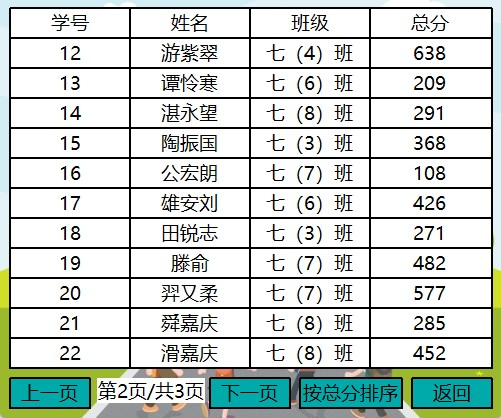

# 使用 EasyX 实现的学生成绩管理系统

## 程序介绍

这是一个使用 C++ 和 EasyX 绘图库实现的学生成绩管理系统，里面包含了查看学生、搜索学生、添加学生、删除学生、清空学生、按学号排序、按总分排序这些功能。简单地封装了一下界面，比如 Button 类、Table 类等等，使得程序可以添加按钮、表格等控件，在细节方面处理得也比较到位。其实代码中最复杂的部分就是封装界面的部分，既难理解，又麻烦，大家了解一下就行，在实际开发中我们更应该注重业务逻辑的实现，而不是界面封装。代码中运用到了一些类、继承、多态等面向对象特性，值得初学者学习。最后，如果项目中有不足，大家可以在评论区留言，我会尽力修改，大家一起进步，一起学习！

## 程序截图

图 1 - 程序主窗口界面

 

图 2 - 查看学生界面

 

图 3 - 编辑学生界面

## 代码分析

### 1. GUI 的封装

因为 EasyX 本质上就是一个绘图库，无法实现 GUI 功能，所以代码封装了一个抽象基类 Widget 来作为所有窗口的基类。控件本质上也是一个窗口，所以定义一个 Button 类和 Table 类继承 Widget 类，用来分别实现按钮部件和表格部件。最后定义一个 Window 类继承 Widget 类，用来实现窗口，GUI 代码的封装就完成了。

### 2. 业务逻辑的实现

为了管理学生数据，可以封装一个 Manager 类，里面定义一些管理学生的操作，比如添加学生、删除学生、排序等操作，这样就实现了管理学生。而剩下的操作都是在 Window 类中实现，可以看出 GUI 的封装要比业务逻辑的实现复杂许多。

## 更新和修复

### 2023 年 1 月 31 日

1. 修复按钮屏闪的问题。
2. 修复查看学生为第 1 页时，向上翻页出现错误的问题。
3. 优化部分代码逻辑。
4. 优化在未修改学生数据时，可以直接退出程序。
5. 添加删除学生时要先搜索学生的提示。
6. 添加编辑学生时，添加学生的格式判断。

### 2022 年 7 月 22 日

1. 发布程序。

## 主页

[CodeBus - Qt小徐](https://codebus.cn/qtlittlexu/)
